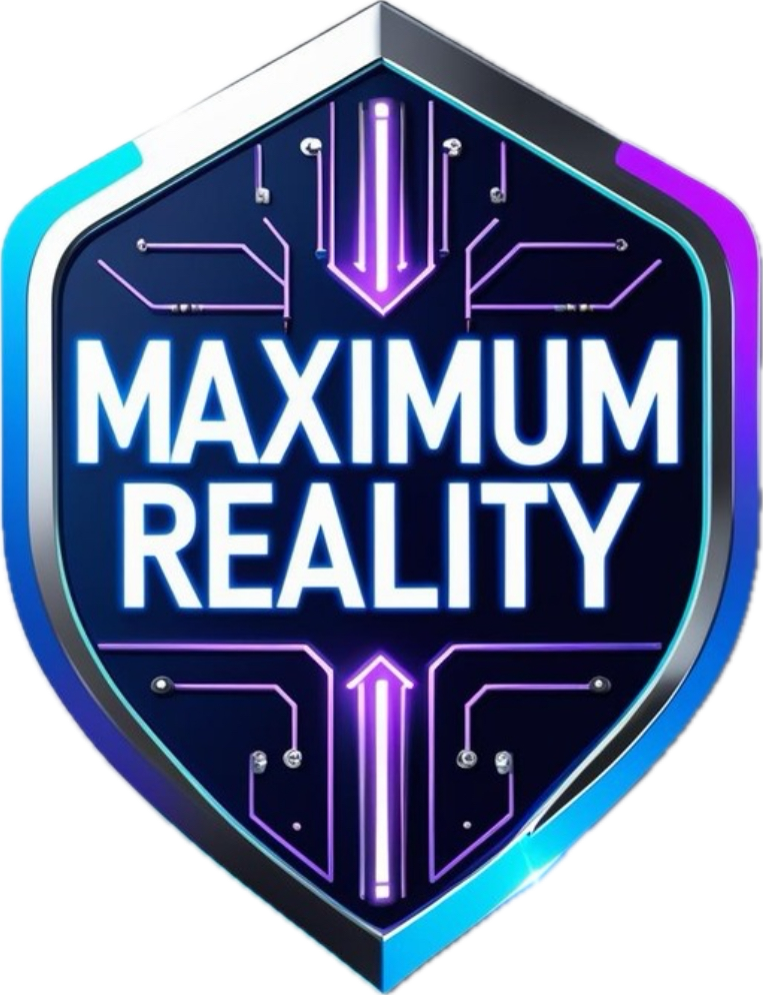

# 🌌 Maximum Reality
### The static between what you see and what is actually there.

Welcome to **Maximum Reality** — a surreal neon-grid universe where perception bends, glitches whisper, and impossible worlds open quietly.

This is not just a collection of games or stories.  
It is an evolving signal.

Here, reality is unstable.  
Meaning is interactive.  
And the glitch is often where the magic lives.

---

## ✨ Enter the Signal

╔════════════════════════════════════════╗  
  
╚════════════════════════════════════════╝  

If you feel out of sync with the normal world,  
you may already be tuned correctly.

---

## 🎮 Explore the Universe

🕹️ **Arcade Portal**  
https://maximumreality.github.io/maximum-reality-arcade/

📺 **Signal Broadcasts (Video Channel)**  
https://www.youtube.com/@MaximumRealityLori

📖 **Lore Archives**  
(coming online)

✉️ **Contact / Social Interface**  
(coming online)

---

## 📱 Connect Through the Neon

🌈 Instagram  
https://www.instagram.com/maximumrealitylori

🎵 TikTok  
https://www.tiktok.com/@zer0chick

---

## ⚡ About This Reality

Maximum Reality is an indie-created, AI-assisted transmedia universe exploring:

• perception vs existence  
• surreal humor  
• cosmic loneliness and connection  
• interactive storytelling  
• experimental digital myth-making  

It is built in fragments.  
It evolves unpredictably.  
It is meant to be entered, not just viewed.

---

## 🌐 Multiverse Infrastructure

GitHub Nexus  
https://github.com/MaximumReality

All worlds originate from signal experiments conducted by creator Lori.

Transmission ongoing.
